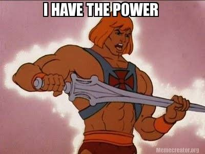
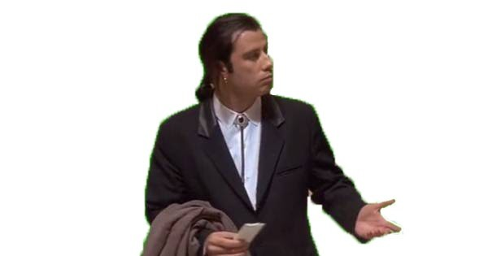

Ako guglamo, čitamo naokolo, pregledamo brdo informacija ili čak pitamo AI kao što je ChatGPT, svi će manje-više reći isto: da !important CSS pravilo može negativno uticati na vaš veb sajt.

Na svojoj linkedin profil objavi pitao sam svoje konekcije, iskuskne veb developere šta misle o ovoj temi i rezultati su bili šareni, više o ovo anketi možete pročitati [ovde](https://www.linkedin.com/feed/update/urn:li:activity:7201524440273154048/).

Pre nego što pređemo na praktične primere, moramo teoretski da objasnimo šta je `!important` pravilo.

## Šta je `!important` pravilo?

Sigurno ste mnogo puta čitajući CSS kod naišli na !important pravilo. Nije baš dobro koristiti ga previše puta u jednom CSS fajlu, ali ponekad je to neophodno. 😅

I videli ste da ima "super moći" – nadjačava sve ostalo, i CSS "sluša" samo njega.

CSS ima svoju hijerarhiju stilizovanja HTML-a. Postoji razlika u CSS-u u tome da li se element stilizuje ciljajući element putem ID-a, klase, možda samog elementa ili u kombinaciji. Takođe, može biti bitno da li se CSS linija nalazi na početku ili na kraju fajla. Međutim, kada naiđe `!important`, sve ostalo pada u vodu.

Dakle, `!important` rule gazi svo css stilizovanje, i browser slusa iskljucivo !important naredbe.

Primer:

    element { 
        color: red !important; 
    }

 Ovo znači da će element biti crvene boje bez obzira na to kako je stilizovan ispod ili iznad ove linije.

 

 > "Kada CSS parser uoči !important, pita se: Odakle sada da povučem stil? A? 😱"

 A **šta praksa kaže**? 

 Kaže da treba izbegavati `!important` pravilo. Ne zbog performansi, jer mala je verovatnoća da će biti toliko `!important` pravila da će drasticno usporiti sajt, nego zato što stilizovanje elemenata kroz ceo projekat može postati dosta bolna stvar, a da ne govorimo o tome da ovo jedno `!important` povlači dosta drugih.

 U praksi, potpuno je u redu koristiti `!important`, ali samo u specifičnim situacijama. Na primer, ako imamo dugme koje mora biti crvene boje u slučaju da odgovor sa servera bude negativan, tada je prihvatljivo da trenutno bude crveno, uz korišćenje !important.

 Ukratko, možeš slobodno koristiti `!important`, ali izbegavaj ga gde god je to moguće, jer će se to na kraju obiti o glavu.
