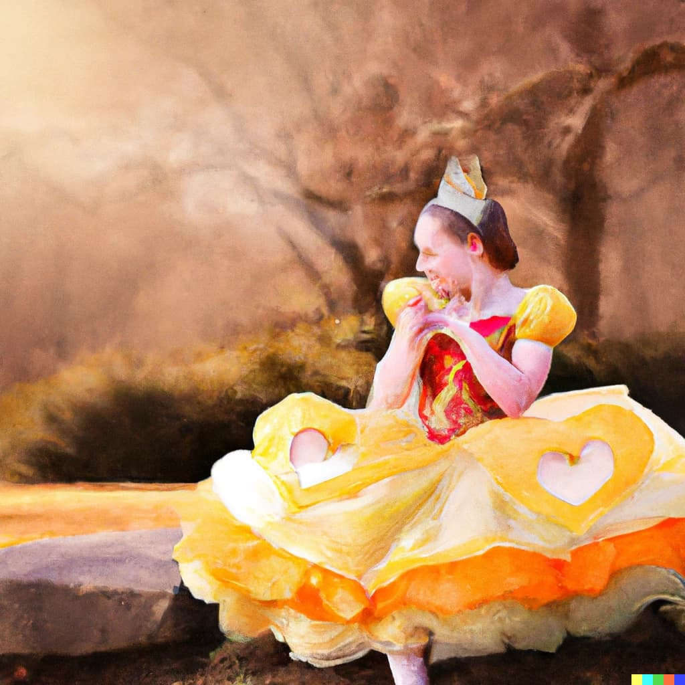

<!--  -->

Dobrodošao! Ovo je blog namenjen IT-jevacima i raznoraznim IT temama. Cilj nam je da pokažemo i objasnimo šta praksa zapravo kaže. Uvek je sjajno teoretski proći i naučiti, ali praksa često pokaže drugačije...

  

## Par reči o ideji samog bloga.

  

Ovde želimo da pokažemo jasnu razliku između teorije i prakse, kako to u teoriji zvuči i kako to praktično izgleda.
  

<!-- > "Welcome, traveler!" exclaimed the leader of the fairies. "We are the guardians of the enchanted forest. What brings you here?" -->

  

Ne želim da trošim previše vremena, tako da **pređimo na stvar**!

  

## Kako doprineti blogu?

  

Na ovom [linku](https://github.com/MiloshN/stapraksakaze)  se nalazi GitHub repozitorijum sa ovom temom. Ako imate neku ideju, slobodno klonirajte repozitorijum, napišite blog, napravite pull request na main granu, pregledajte objavu i vrlo rado ću je objaviti. Srećno! 👋
<!-- 
  

## The Hidden Treasure

  

Finally, the fairies led Alice to a secluded grove where a magnificent tree stood tall. The tree's trunk was adorned with sparkling gems, and its branches were laden with golden apples. The fairies explained that the tree was the guardian of the enchanted forest and the treasure she sought was hidden within.

  

Alice reached out and plucked one of the golden apples, and to her amazement, it transformed into a key. She approached the tree and inserted the key into a hidden keyhole, and the tree split open, revealing a hidden chamber filled with untold riches and ancient artifacts. -->

<!--   

## A Lesson Learned

  

  

As Alice marveled at the treasure before her, she realized that the true treasure she had discovered was not the wealth, but the journey itself. She had learned the value of courage, perseverance, and friendship. With a heart full of gratitude, Alice bid farewell to the fairies and left the enchanted forest, forever changed by her adventure.

  

And so, Alice returned to her village, sharing tales of her remarkable adventure in the enchanted forest. Her story spread far and wide, inspiring others to embark on their own journeys of discovery.

  

And that, dear reader, is how Alice's adventure in the enchanted forest came to an end, but the memories of her courageous quest would remain with her forever.

  

> "The greatest treasure lies within the journey itself." - Alice -->